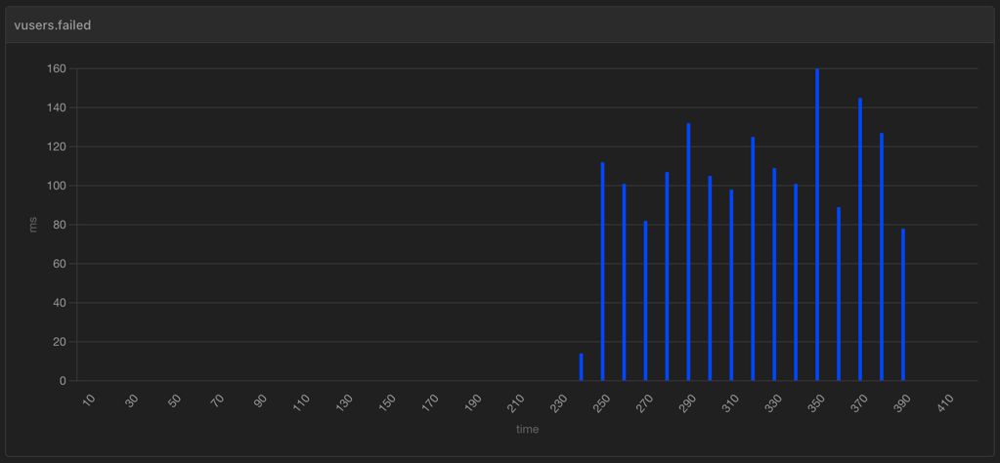

# Load test for the chat app

## Running load test

Install [Artillery](https://www.artillery.io/) globally:

```shell
npm ci
```

Run load test:

```shell
npm run load-test
```

Create an HTML report:

```shell
npm run gen-report
```

You can change the load test configuration by editing
[chat-test.yml](chat-test.yml).

## Results for websocket-chat

Results below shows no errors for a sustained load of 20 users/second, but ~5200
errors at a sustained load of 50 users/second.

### Arrival rate: 20 users/second (2022-12-03)

```text
vusers.completed: .............................................................. 4570
vusers.created: ................................................................ 4570
vusers.created_by_name.Chat test: .............................................. 4570
vusers.failed: ................................................................. 0
vusers.session_length:
  min: ......................................................................... 10000.3
  max: ......................................................................... 10121.1
  median: ...................................................................... 9999.2
  p95: ......................................................................... 9999.2
  p99: ......................................................................... 9999.2
websocket.messages_sent: ....................................................... 45700
websocket.send_rate: ........................................................... 138/sec
```

### Arrival rate: 50 users/second (2022-12-03)

```text
errors.connect ECONNRESET 127.0.0.1:8080: ...................................... 2
errors.connect ETIMEDOUT 127.0.0.1:8080: ....................................... 5210
vusers.completed: .............................................................. 4741
vusers.created: ................................................................ 9953
vusers.created_by_name.Chat test: .............................................. 9953
vusers.failed: ................................................................. 5212
vusers.session_length:
  min: ......................................................................... 10000.4
  max: ......................................................................... 52130.3
  median: ...................................................................... 26643.2
  p95: ......................................................................... 45720.8
  p99: ......................................................................... 48548.1
websocket.messages_sent: ....................................................... 47410
websocket.send_rate: ........................................................... 134/sec
```

Here's a sample report for arrival rate of 50 users/second:



## Results for ws-chat

Results below show ~4000 errors at a sustained load of 50 users/second, which is
somewhat less that ~5200 errors in the case of websocket-chat.

### Arrival rate: 50 users/second (2022-12-03)

```text
errors.connect ECONNRESET 127.0.0.1:8080: ...................................... 1
errors.connect ETIMEDOUT 127.0.0.1:8080: ....................................... 3893
vusers.completed: .............................................................. 6064
vusers.created: ................................................................ 9958
vusers.created_by_name.Chat test: .............................................. 9958
vusers.failed: ................................................................. 3894
vusers.session_length:
min: ......................................................................... 10000.4
max: ......................................................................... 57633.2
median: ...................................................................... 18588.1
p95: ......................................................................... 49528.8
p99: ......................................................................... 55843.8
websocket.messages_sent: ....................................................... 60640
websocket.send_rate: ........................................................... 203/sec
```

## Results for ws-chat-with-redis

Results below show 0 errors at a sustained load of 50 users/second, which is
fantastic!!!

### Arrival rate: 50 users/second (2022-12-03)

```text
vusers.completed: .............................................................. 9964
vusers.created: ................................................................ 9964
vusers.created_by_name.Chat test: .............................................. 9964
vusers.failed: ................................................................. 0
vusers.session_length:
min: ......................................................................... 10003.4
max: ......................................................................... 341504
median: ...................................................................... 114730.2
p95: ......................................................................... 287900.2
p99: ......................................................................... 337855.8
websocket.messages_sent: ....................................................... 99640
websocket.send_rate: ........................................................... 262/sec
```

### Arrival rate: 50 users/second (2024-10-10)

```text
errors.ECONNRESET: ............................................................. 24
errors.socket hang up: ......................................................... 24
vusers.completed: .............................................................. 9936
vusers.created: ................................................................ 9960
vusers.created_by_name.Chat test: .............................................. 9960
vusers.failed: ................................................................. 24
vusers.session_length:
  min: ......................................................................... 10000.7
  max: ......................................................................... 83043.5
  mean: ........................................................................ 15234.3
  median: ...................................................................... 11274.1
  p95: ......................................................................... 45720.8
  p99: ......................................................................... 60495.1
websocket.messages_sent: ....................................................... 99360
websocket.send_rate: ........................................................... 359/sec
```
