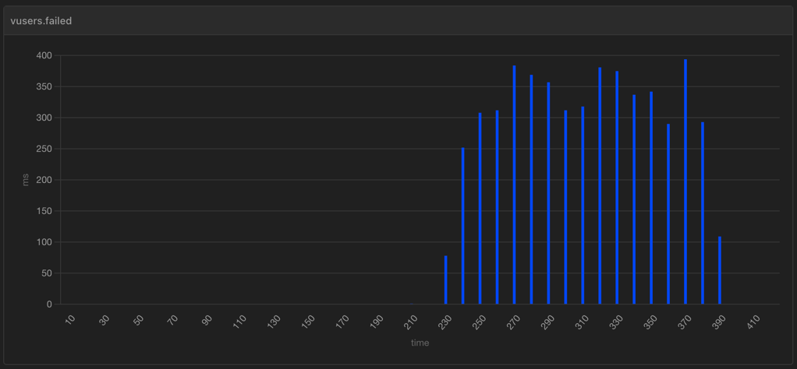

# Load test for the chat app

## Running load test

Install [Artillery](https://www.artillery.io/) globally:

```shell
npm install -g artillery
```

Run load test:

```shell
artillery run chat-test.yml --output result.json
```

Create an HTML report:

```shell
artillery report result.json
```

You can change the load test configuration by editing [chat-test.yml](chat-test.yml).

## Results for websocket-chat

Results below shows progressively more errors as the sustained load is increased
from 20 users/second to 50 users/second.

### Arrival rate: 20 users/second

```text
errors.connect ECONNRESET 127.0.0.1:8080: ...................................... 1
errors.connect ETIMEDOUT 127.0.0.1:8080: ....................................... 1684
vusers.completed: .............................................................. 2872
vusers.created: ................................................................ 4557
vusers.created_by_name.Chat test: .............................................. 4557
vusers.failed: ................................................................. 1685
vusers.session_length:
min: ......................................................................... 10001
max: ......................................................................... 73014.8
median: ...................................................................... 38189
p95: ......................................................................... 62964
p99: ......................................................................... 68208.3
websocket.messages_sent: ....................................................... 28720
websocket.send_rate: ........................................................... 53/sec
```

### Arrival rate: 25 users/second

```text
errors.connect ECONNRESET 127.0.0.1:8080: ...................................... 3
errors.connect ETIMEDOUT 127.0.0.1:8080: ....................................... 2524
vusers.completed: .............................................................. 2917
vusers.created: ................................................................ 5444
vusers.created_by_name.Chat test: .............................................. 5444
vusers.failed: ................................................................. 2527
vusers.session_length:
min: ......................................................................... 10000.8
max: ......................................................................... 70698.2
median: ...................................................................... 38960.5
p95: ......................................................................... 65533.7
p99: ......................................................................... 68208.3
websocket.messages_sent: ....................................................... 29170
websocket.send_rate: ........................................................... 112/sec
```

### Arrival rate: 50 users/second

```text
errors.connect ECONNRESET 127.0.0.1:8080: ...................................... 3
errors.connect ETIMEDOUT 127.0.0.1:8080: ....................................... 7031
errors.write EPIPE: ............................................................ 1
vusers.completed: .............................................................. 2915
vusers.created: ................................................................ 9950
vusers.created_by_name.Chat test: .............................................. 9950
vusers.failed: ................................................................. 7035
vusers.session_length:
min: ......................................................................... 10001.1
max: ......................................................................... 70383.3
median: ...................................................................... 41369.7
p95: ......................................................................... 62964
p99: ......................................................................... 69586.2
websocket.messages_sent: ....................................................... 29150
websocket.send_rate: ........................................................... 113/sec
```

Here's a sample report for arrival rate of 20 users/second:


